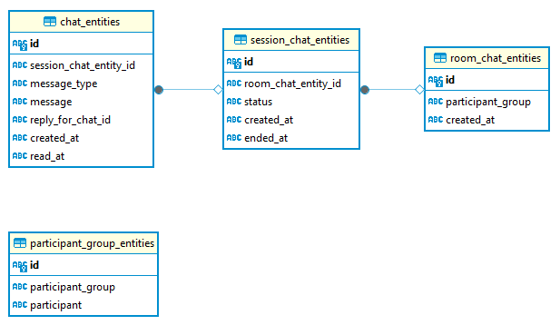

# MYCHAT

[](https://github.com/ac-kurniawan/mychat/actions/workflows/workflow.yml)

Chat application

## Requirement

1. GO 1.20

## ERD



## Configuration

```yaml
env: local
appName: Mychat
httpServer:
  port: 8080
sqlite:
  runMigration: true # if this value is true the ORM tools will create the table and fill the created table with data seed
  filePath: test.db # SQLite file path
trace:
  enable: true
  hostExporter: https://example.com:4317 # this is required if trace.enable = true
  apiKey: 123asd123asd # this is required if trace.enable = true
```

## How to run

1. fill the configuration in `properties.yml`
2. generate all of necesarry file using `make generate`
3. run command `go run main`
4. After the apps run properly you can test the REST API using swagger UI in http://localhost:8080/swagger/index.html
